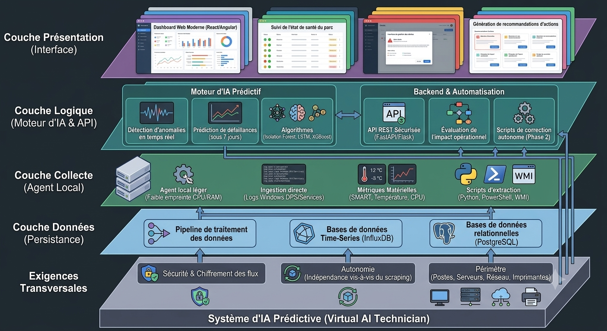

# RAG-Driven Intelligent IT Maintenance Platform
An enterprise-grade, AI-powered predictive maintenance and technical assistant platform designed to monitor IT infrastructure, detect real-time anomalies, anticipate hardware failures, and assist technicians via Retrieval-Augmented Generation (RAG).

## Objectives
- **Primary:** Eliminate reliance on manual monitoring and external scraping by enabling direct hardware log ingestion and automated system health tracking.
- **AI Engineering (Advanced):** Implement predictive AI models and time-series anomaly detection algorithms to forecast hardware failures (e.g., storage degradation, system log errors, and device performance bottlenecks) and deliver actionable maintenance recommendations before downtime occurs.

## Archtecture global :
global Archtecture for this solution is :

rag-it-maintenance/
├── docs/                   # System documentation & UML diagrams
├── services/
│   ├── agent/              # Monitoring Agent (WMI, SNMP, Event Logs)
│   ├── backend/            # FastAPI REST API & Database Connectors
│   ├── frontend/           # React Supervision Dashboard
│   ├── ml-engine/          # Anomaly Detection & Predictive Models
│   └── rag-service/        # RAG Engine, Document Loaders & Vector Store
├── docker-compose.yml      # Multi-container orchestration (PostgreSQL, InfluxDB, ChromaDB)
├── Makefile                # Shortcut CLI commands for development
└── README.md