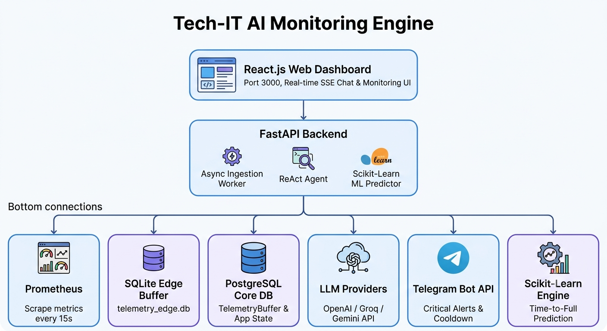

# RAG-Driven Intelligent IT Maintenance Platform

[](https://www.python.org/)
[](https://fastapi.tiangolo.com/)
[](https://www.docker.com/)
[](https://www.postgresql.org/)

An enterprise-grade, AI-powered predictive maintenance and technical assistant platform designed to monitor IT infrastructure, detect real-time anomalies, anticipate hardware failures, and assist technicians via Retrieval-Augmented Generation (RAG).

---

## Objectives

### Primary Objective
Eliminate reliance on manual monitoring and external scraping by enabling direct hardware log ingestion and automated system health tracking. The platform collects telemetry from edge devices, stores structured metrics in PostgreSQL, and provides a unified API for querying system state.

### AI-Powered Engineering
- **Predictive Anomaly Detection** — Time-series analysis of CPU, RAM, and GPU metrics to forecast hardware failures before downtime occurs.
- **Intelligent Agent** — A Retrieval-Augmented Generation (RAG) agent that queries real-time telemetry and system logs to answer technician questions and generate maintenance reports.
- **Automated Reporting** — On-demand report generation with health summaries, anomaly breakdowns, and actionable recommendations.





### Key Capabilities
| Capability | Description |
|---|---|
| Telemetry Collection | Edge devices push CPU, RAM, GPU, and peripheral metrics to a local SQLite buffer |
| Log Aggregation | System logs are synced to PostgreSQL for querying and analysis |
| Anomaly Detection | Threshold-based alerts for CPU >75%, RAM >75%, and critical >90% usage |
| LLM Integration | Supports OpenRouter, OpenAI, Groq, and Gemini providers with mock fallback |
| Observability | Prometheus metrics endpoint at `/metrics` with Grafana dashboards |

---

## Architecture

### High-Level Overview

```
┌─────────────────────────────────────────────────────────────────┐
│                        Tech-IT Agent App                        │
├─────────────┬──────────────────┬────────────────────────────────┤
│  Edge Agent │   FastAPI Backend │          Frontend UI          │
│  (collector)│   (main.py)       │     (Streamlit / Gradio)     │
│             │                   │                              │
│  - SQLite   │  - REST API       │  - Dashboard                 │
│  - Telemetry│  - CORS middleware│  - Chat with AI Agent        │
│  - Buffer   │  - Prometheus     │  - Log viewer                │
│  - Local    │  - SQLAlchemy     │  - Traffic generator         │
└──────┬──────┴────────┬─────────┴──────────────────────────────┘
       │               │
       ▼               ▼
┌──────────────┐  ┌──────────────┐
│  PostgreSQL   │  │  Prometheus   │
│  (tech_it_db) │  │  (metrics)    │
│               │  │               │
│  - system_logs│  │  - http_reqs  │
│  - telemetry  │  │  - latency    │
│  - synced flag│  │  - errors     │
└──────────────┘  └──────┬───────┘
                         │
                         ▼
                   ┌──────────────┐
                   │    Grafana    │
                   │  (dashboards) │
                   └──────────────┘
```

### Layer Breakdown

| Layer | Directory | Responsibility |
|---|---|---|
| **AI Agent** | `backend/ai_agent/` | LLM integration, tool definitions, mock fallback, conversation management |
| **Data Layer** | `backend/couche_data/` | Repositories, services, schemas (Pydantic), telemetry processing |
| **Database** | `backend/database.py`, `backend/models.py` | PostgreSQL connection, SQLAlchemy ORM models |
| **Edge Collector** | `backend/system_event_loader/` | Local SQLite telemetry buffer, Prometheus metrics |
| **API** | `main.py` | FastAPI endpoints, CORS, Prometheus middleware, health check |
| **Frontend** | `frontend/ai_agent_ui/` | Streamlit UI for chat, logs, records, and traffic generation |

### Data Flow

1. **Edge devices** collect telemetry (CPU, RAM, GPU, peripherals) and write to `telemetry_edge.db` (SQLite)
2. **Backend API** reads unsynced records via `TelemetryRepository` and exposes them through `/api/telemetry`
3. **AI Agent** queries the API or database directly to gather context and generate responses
4. **Prometheus** scrapes `/metrics` for HTTP request counts and latency
5. **Grafana** visualizes metrics from Prometheus and PostgreSQL exporter

---

## Repository Structure

```text
Tech-IT-agent-app/
├── backend/
│   ├── ai_agent/              # AI Agent layer (LLM integration, tools)
│   │   ├── agent.py           # TechITAgent class, tool definitions, LLM providers
│   │   └── __init__.py
│   ├── couche_data/           # Data layer (repositories, services, schemas)
│   │   ├── controller/        # TelemetryController
│   │   ├── models/            # TelemetryBufferModel (SQLAlchemy)
│   │   ├── repositories/      # TelemetryRepository
│   │   ├── schemas/           # Pydantic schemas (TelemetryParsed, TelemetryPayload)
│   │   ├── services/          # TelemetryService
│   │   └── tests/             # Data layer tests
│   ├── system_event_loader/   # Edge telemetry collector
│   │   ├── collector.py       # Prometheus metrics collector
│   │   └── telemetry_edge.db  # Local SQLite buffer
│   ├── database.py            # PostgreSQL database setup
│   ├── models.py              # SQLAlchemy models (SystemLog)
│   └── __init__.py
├── frontend/
│   └── ai_agent_ui/           # Streamlit UI
│       ├── app.py
│       ├── pages/
│       │   ├── 1_List_Records.py
│       │   ├── 2_Ask_Agent.py
│       │   ├── 3_Logs.py
│       │   └── 4_Traffic_Generator.py
│       ├── utils.py
│       └── requirements.txt
├── main.py                    # FastAPI application entry point
├── docker-compose.yml         # Production orchestration
├── docker-compose.prod.yml    # Production overrides
├── Dockerfile                 # Backend container build
├── .env.example               # Environment template
├── .env                       # Environment variables (not committed)
├── .gitignore
├── .dockerignore
├── Makefile
├── pyproject.toml
├── requirements.txt
├── prometheus.yml
└── README.md
```

## Production Deployment

### Prerequisites
- Docker and Docker Compose installed
- A valid LLM API key (OpenRouter, OpenAI, Groq, or Gemini)

### Quick Start

1. Copy the environment template and configure your secrets:
```bash
cp .env.example .env
# Edit .env with your actual API keys and database credentials
```

2. Start all services:
```bash
make dev-up
```

3. For production deployment:
```bash
make prod
```

### Environment Variables

| Variable | Description | Default |
|---|---|---|
| `OPENROUTER_API_KEY` | LLM API key | - |
| `POSTGRES_USER` | Database user | admin |
| `POSTGRES_PASSWORD` | Database password | - |
| `POSTGRES_HOST` | Database host | localhost |
| `POSTGRES_PORT` | Database port | 5432 |
| `POSTGRES_DB` | Database name | tech_it_db |
| `CORS_ORIGINS` | Allowed CORS origins | http://localhost:3000 |
| `API_HOST` | API bind host | 0.0.0.0 |
| `API_PORT` | API bind port | 8000 |
| `API_RELOAD` | Enable auto-reload | false |

## 3. Recommended Git Commit Conventions

To maintain a clean and structured git history across the monorepo, follow the **Conventional Commits** standard:

| Prefix | Category | Scope Examples | Usage Example |
| :--- | :--- | :--- | :--- |
| `feat:` | New Feature | `agent`, `backend`, `rag`, `ui` | `feat(agent): add WMI parser for SMART disk health` |
| `fix:` | Bug Fix | `backend`, `ml-engine`, `database` | `fix(backend): patch InfluxDB write timeout during CPU spikes` |
| `docs:` | Documentation | `readme`, `architecture`, `rag` | `docs(rag): upload vendor manuals to vector index directory` |
| `refactor:` | Code Refactoring | `agent`, `ml-engine`, `core` | `refactor(ml-engine): optimize Isolation Forest inference pipeline` |
| `perf:` | Performance Improvements | `backend`, `vectorstore` | `perf(vectorstore): speed up ChromaDB semantic search queries` |
| `test:` | Unit & Integration Tests | `backend`, `agent`, `ci` | `test(agent): add pytest cases for Windows Event log parsing` |
| `ci:` | CI/CD Pipelines | `github-actions`, `docker` | `ci: add GitHub Actions workflow for pytest and linting` |
| `chore:` | Maintenance & Dependencies | `repo`, `deps`, `docker` | `chore(deps): upgrade FastAPI and LangChain dependencies` |